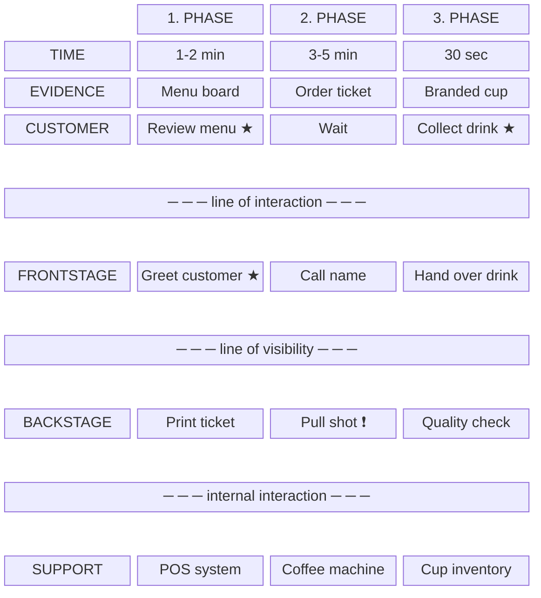
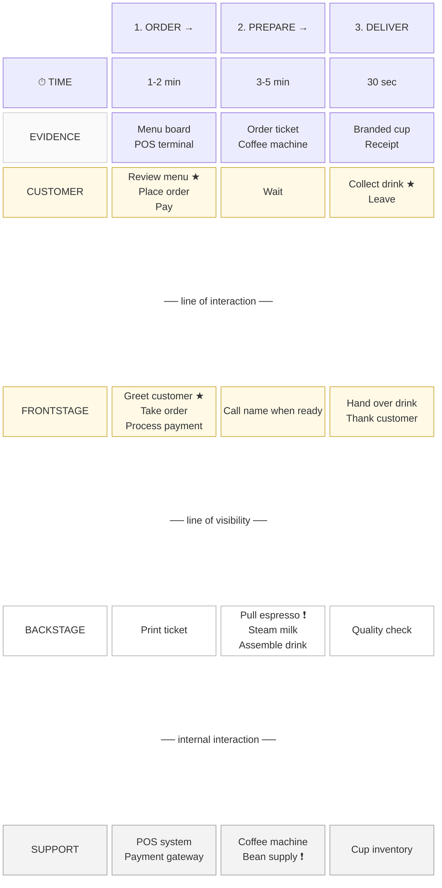

# Service Blueprint Rendering

Output specifications for HTML and Mermaid formats.

---

## Format Comparison

| Aspect | HTML | Mermaid |
|--------|------|---------|
| **Best for** | Standalone artifacts, presentations | Documentation, Markdown embedding |
| **Interactivity** | Full styling, hover states | Static diagram |
| **Markers** | ★ and ! as styled spans | [★] and [!] in text |
| **Variants** | Colored badge spans | Text suffixes (SS), (EN) |
| **Legend** | Full visual legend | Text-based note |
| **File size** | Larger (includes CSS) | Compact |

---

# HTML Rendering

## Grid Structure

```html
<div class="blueprint">
  <!-- Grid: label column + phase columns -->
  <!-- grid-template-columns: 100px repeat(N, 1fr) where N = phase count -->
</div>
```

## Lane Order (Top to Bottom)

1. Phase headers
2. Time row
3. Physical Evidence
4. Customer Actions
5. **Line of Interaction** (divider)
6. Frontstage Actions
7. **Line of Visibility** (divider)
8. Backstage Actions
9. **Line of Internal Interaction** (divider)
10. Support Processes

## Box Styles

```css
/* Base box */
.box {
  background: #fff;
  border: 1px solid #bbb;
  border-radius: 3px;
  padding: 5px 8px;
  font-size: 9px;
  text-align: center;
  margin: 2px 0;
  max-width: 125px;
  position: relative;
}

/* Customer-facing (yellow) */
.box.customer, .box.frontstage {
  background: #fff9e6;
  border-color: #c9a227;
}

/* Internal (white) */
.box.backstage {
  background: #fff;
  border-color: #aaa;
}

/* Support (grey) */
.box.support {
  background: #f3f3f3;
  border-color: #999;
}

/* Evidence (light) */
.box.evidence {
  background: #fafafa;
  border-color: #ccc;
  font-size: 8px;
}

/* Muted/inactive */
.box.muted {
  background: #f5f5f5;
  border-style: dashed;
  color: #666;
}
```

## Arrow System

### Horizontal Arrows (Between Phases)

```css
.h-arrow {
  position: absolute;
  right: -8px;
  top: 50%;
  transform: translateY(-50%);
  display: flex;
  align-items: center;
}

.h-arrow .stem {
  width: 10px;
  height: 0;
  border-top: 1.5px solid #999;
}

.h-arrow .head {
  width: 0;
  height: 0;
  border-top: 4px solid transparent;
  border-bottom: 4px solid transparent;
  border-left: 6px solid #999;
}

/* Double-headed (negotiation) */
.h-arrow.double .head-left {
  border-top: 4px solid transparent;
  border-bottom: 4px solid transparent;
  border-right: 6px solid #999;
}
```

### Vertical Arrows (Layer Connections)

```css
.v-arrow {
  display: flex;
  flex-direction: column;
  align-items: center;
  margin-bottom: 4px;
}

.v-arrow .stem {
  width: 0;
  height: 12px;
  border-left: 1.5px solid #999;
}

.v-arrow .head {
  border-left: 4px solid transparent;
  border-right: 4px solid transparent;
  border-top: 6px solid #999;
}
```

### Arrow Placement Rules

- Horizontal arrows: After each phase cell **except the last**
- Vertical arrows: At top of each cell **below a divider line**
- Double arrows: Where `arrowType: "double"` in schema

## Markers

```css
/* Moment of truth (red, top-right) */
.mot {
  position: absolute;
  top: -4px;
  right: -4px;
  width: 10px;
  height: 10px;
  background: #ef4444;
  border-radius: 50%;
  font-size: 7px;
  color: #fff;
  display: flex;
  align-items: center;
  justify-content: center;
}

/* Failure point (dark yellow, top-left) */
.fail {
  position: absolute;
  top: -4px;
  left: -4px;
  width: 10px;
  height: 10px;
  background: #8b6914;
  border-radius: 50%;
  font-size: 6px;
  color: #fff;
  display: flex;
  align-items: center;
  justify-content: center;
}
```

## Divider Lines

```css
.divider {
  grid-column: 1 / -1;
  display: flex;
  align-items: center;
  height: 20px;
}

.divider-label {
  width: 100px;
  font-size: 8px;
  color: #888;
  font-style: italic;
  text-align: right;
  padding-right: 10px;
}

.divider-line {
  flex: 1;
  border-top: 1.5px dashed #aaa;
}
```

## Variant Badges

```css
.badge {
  font-size: 6px;
  font-weight: 700;
  padding: 1px 3px;
  border-radius: 2px;
  margin-left: 2px;
}

/* Use inline styles for variant colors from schema */
```

## Common Issues and Fixes

| Issue | Cause | Fix |
|-------|-------|-----|
| Arrows misaligned | Cell has no `position: relative` | Add `position: relative` to `.cell` |
| Markers cut off | Container has `overflow: hidden` | Remove overflow constraint or add padding |
| Grid columns uneven | Wrong `grid-template-columns` | Use `100px repeat(N, 1fr)` where N = phase count |
| Last phase has arrow | Missing `arrowType: "none"` | Hide arrow on last cell with `.cell:last-child .h-arrow { display: none }` |

---

# Mermaid Rendering

Mermaid doesn't natively support service blueprint layouts, so we use a **block diagram** with careful structure to approximate the grid format.

## Basic Structure



## Marker Convention

Since Mermaid can't render styled markers, use text conventions:

| Marker | HTML | Mermaid |
|--------|------|---------|
| Moment of truth | `<span class="mot">★</span>` | ` ★` at end of text |
| Failure point | `<span class="fail">!</span>` | ` ❗` at end of text |
| Variant badge | `<span class="badge">SS</span>` | ` (SS)` at end of text |

## Styling

```mermaid
%%{init: {
  'theme': 'base',
  'themeVariables': {
    'primaryColor': '#fff9e6',
    'primaryBorderColor': '#c9a227',
    'secondaryColor': '#f3f3f3',
    'tertiaryColor': '#fafafa'
  }
}}%%
```

## Arrow Handling

Mermaid block diagrams don't support arrows between blocks in the same way. Options:

1. **Omit arrows** — Accept that Mermaid is a simplified view
2. **Use flowchart subgraphs** — More complex but allows arrows
3. **Add arrow text** — Include `→` in phase headers: `"1. ORDER →"`

Recommended: Option 1 (omit) for clarity, or Option 3 (text arrows) for visual flow.

## Full Example: Coffee Shop



## Mermaid Limitations

| Limitation | Workaround |
|------------|------------|
| No marker positioning | Use text suffixes (★, ❗) |
| No badge styling | Use text suffixes ((SS), (EN)) |
| Limited color control | Apply styles per-node |
| No true arrows between columns | Use → in headers or omit |
| Complex blueprints get messy | Use HTML for >4 phases |

## Recommendation

- **3-4 phases**: Mermaid works well
- **5-6 phases**: Mermaid possible but cramped
- **7+ phases**: Use HTML

---

# Checklist (Both Formats)

Before outputting, verify:

**Structure**
- [ ] All 5 lanes present
- [ ] All 3 divider lines present
- [ ] Time row with durations
- [ ] 8-12 customer actions total

**Flow**
- [ ] Arrows between phases (except last) — HTML: visual arrows; Mermaid: → in headers
- [ ] Vertical connection indicated below dividers — HTML: v-arrows; Mermaid: implicit

**Analysis**
- [ ] Moments of truth marked (★)
- [ ] Failure points marked (❗ or !)
- [ ] Markers are meaningful, not decorative

**Legend**
- [ ] HTML: Full visual legend at bottom
- [ ] Mermaid: Note block explaining ★ and ❗

**Polish**
- [ ] Version and date (in subtitle or metadata)
- [ ] Consistent styling throughout
