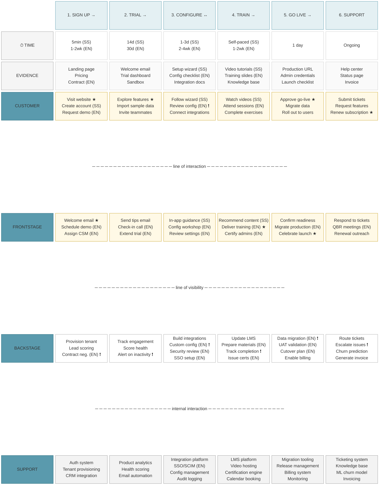

## Legend

| Symbol | Meaning |
|--------|---------|
| ★ | Moment of truth — customer perception crystallises |
| ❗ | Failure point — dependency or risk |
| → | One-way flow to next phase |
| ↔ | Negotiation / back-and-forth required |
| (SS) | Self-Serve path only |
| (EN) | Enterprise path only |

## Color Key

| Color | Lane |
|-------|------|
| Yellow (#fff9e6) | Customer-facing (Customer + Frontstage) |
| White (#fff) | Internal actions (Backstage) |
| Light grey (#f3f3f3) | Support systems |
| Very light grey (#fafafa) | Physical evidence |

## Notes

This blueprint compares two onboarding paths:
- **Self-Serve (SS)**: Fast, automated, self-paced
- **Enterprise (EN)**: Longer, high-touch, customised

Items without (SS) or (EN) suffix are common to both paths.
