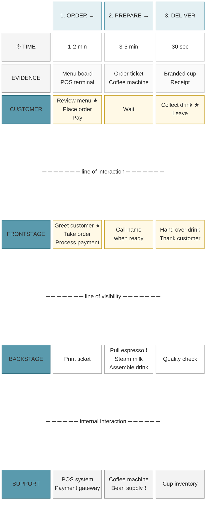

## Legend

| Symbol | Meaning |
|--------|---------|
| ★ | Moment of truth — customer perception crystallises |
| ❗ | Failure point — dependency or risk |
| → | Flow to next phase |

## Notes

- **Yellow boxes**: Customer-facing actions (customer + frontstage)
- **White boxes**: Internal actions (backstage)
- **Grey boxes**: Support systems
